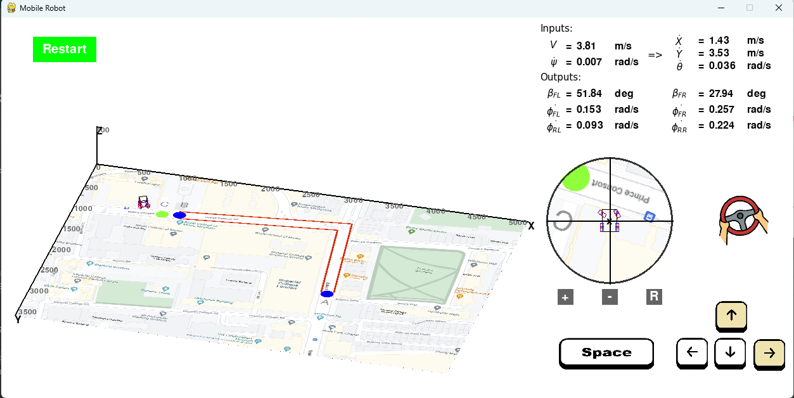
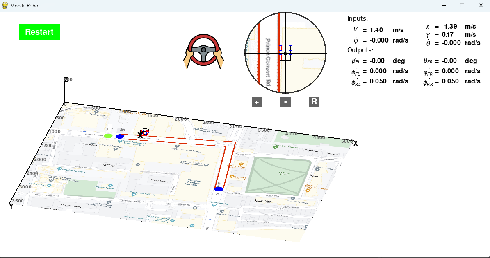

2023.04.05

Comment (2023.03.30):

The current issue occurs when the car is parallel to the wall and collides with it, making it extremely difficult to free the car and it will be stuck forever. This is expected from an engineering perspective, as in reality, when the left side of the car is very close to the wall, it is challenging to move the car without hitting the wall, whether moving forward or backward with a slight turn. This is a failure in terms of gaming experience, but a success in the engineering model.

