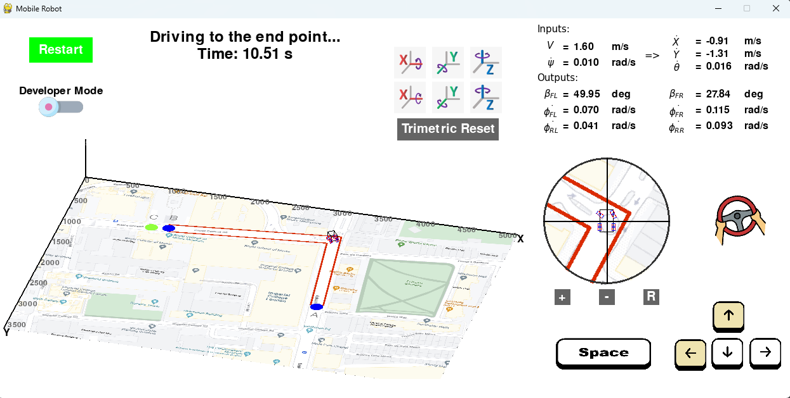

# Ackermann Steering Mobile Car Pygame

## 1. Introduction

This project aims to develop a solution that combines computer vision and mobile robotics to navigate a mobile car through a pre-defined path. By utilising a spatial map, the software identifies the locomotion path and guides the mobile car from a start point to an end point. When reaching the end point, the manipulator mounted on the top the car moves to touch a target position.

A mini-game was developed using *Pygame* which enables the user to control the mobile car through keyboard inputs to accomplish tasks. The car was designed with a four-wheel Ackermann model. After extracting the features of the map using *OpenCV*, the game can identify instances when the car interacts with any map features (path, start, and end points) and respond accordingly. The wheels parameters are calculated through inverse kinematics and displayed in the game window.




## 2. Software Architecture

This is a software based on *Pygame* and *OpenCV* using *Python3*. In order to run this project, these two packages should be installed (otherwise, the game can be run using the *.exe* file):
```
pip install pygame
pip install opencv-python
conda install matplotlib
conda install sympy
conda install IPython
```

Useful files in this project:


* [main.py](main.py): Main file to run the game.
* [inspect_map.ipynb](inspect_map.ipynb): Demonstrations of how the map features were extracted.
* [mobile_robot.ipynb](mobile_robot.ipynb): Demonstrations of the forward and inverse kinematics of the mobile robot.
* [game_function.py](game_function.py): Game functions used throughout the game, including human-computer interaction and event handling.
* [tools_kinematics.py](tools_kinematics.py): Helper functions of robotics kinematics.
* [tools_cv.py](tools_cv.py): Helper functions of feature extractions of images.
* [workspace.py](workspace.py): The main 2D map window in 3D view, with extracted features.
* [car.py](car.py): The 3D car body transformed to several 2D lines, which keeps updating as car moves.
* [inverse_kinematics.py](inverse_kinematics.py): Inverse kinematics of the mobile car, inputs and outputs shown in the "Latex Window".
* [button.py](button.py): Buttons which the user can click.
* [settings.py](settings.py): Game settings to be calibrated, including the positions of all the windows and their paramters.
* [game_stats.py](game_stats.py): The game status, which determines how the game interacts with the user correspondingly.
* [control_panel.py](control_panel.py): Bottom right part of the screen, with zoomed-in map, keyboard and steering wheel visualisation. 
* [latex_window.py](latex_window.py): Top right part of the screen, with car kinematics from user inputs and the resulted outputs. 
* [message_box.py](message_box.py): Top middle part of the screen, delivering information to the user.
* [manipulator.py](manipulator.py): The manipulator which is initiated when the car reaches the end point, with all joints and links transformed from 3D to 2D lines and points.
* [trajectory_planning.py](trajectory_planning.py): Trajectory planning of the manipulator, same methodology as [robot-arm-analysis](https://github.com/sunfanyi/robot-arm-analysis).


## 3. Feature Extraction

### 3.1 Color Extraction

The information to be extracted from the map includes the start and end positions (blue), the manipulator target position (green) and the car path (red), as shown below:


To extract those color features, the RGB image was transformed into HSV (Hue, Saturation and Value) color space. After calibration, the threshold values for the applied masks are:

<table>
  <tr>
    <th rowspan="2"></th>
    <th colspan="2" style="text-align:center">Red</th>
    <th colspan="2" style="text-align:center">Green</th>
    <th colspan="2" style="text-align:center">Blue</th>
  </tr>
  <tr>
    <th>lower</th>
    <th>upper</th>
    <th>lower</th>
    <th>upper</th>
    <th>lower</th>
    <th>upper</th>
  </tr>
  <tr>
    <td>Hue</td>
    <td>15</td>
    <td>165</td>
    <td>45</td>
    <td>75</td>
    <td>90</td>
    <td>120</td>
  </tr>
  <tr>
    <td>Saturation</td>
    <td>210</td>
    <td>255</td>
    <td>180</td>
    <td>255</td>
    <td>180</td>
    <td>255</td>
  </tr>
  <tr>
    <td>Value</td>
    <td>50</td>
    <td>255</td>
    <td>50</td>
    <td>255</td>
    <td>50</td>
    <td>255</td>
  </tr>
</table>

Opening was then applied with a kernel size of 5 to reduce the noise, the final features extracted are shown below:


### 3.2 Collision Detection

To enable the software to detect instances when the car body touches the map features, previous results stored as binary masks are transformed into xy coordinates relative to the map origin.

The car, composed of several lines in 3D space, also has its 2D position represented as xy coordinates. Consequently, a collision can be detected when any point of the coordinates of the map features overlaps with the car body coordinates. This was coded in function *detect\_collision()* from [game_function.py](game_function.py). Figure below shows the collision with the red path.


## 4. Mobile Robotics

### 4.1 Mobile Car Design

The mobile car was designed based on a four-wheel Ackermann model, with two activate rear wheels and two passive front wheels. The front wheels are steerable standard and the rear wheels are fixed standard. This explicitly means that both the velocities and the orientations of the front wheels can be determined from the velocities of the rear wheels. A schematic sketch of the car dimension is shown below:


where $A$ is the car length, $B$ is the car width, $l$ is the wheelbase and $L$ is the distance from the manipulator base to each wheel:

$$
\begin{aligned}
    \alpha_{FL}&=\frac{\pi}{2}  & 
    \beta_{FL}&= f(t) \\  
    \alpha_{FR}&=- \frac{\pi}{2} & 
    \beta_{FR}&= f(t) \\  
    \alpha_{RL}&=\mathrm{atan}{\left(\frac{2 l}{B} \right)} + \frac{\pi}{2}  &
    \beta_{RL}&=- \mathrm{atan}{\left(\frac{2 l}{B} \right)} \\  
    \alpha_{RR}&=- \mathrm{atan}{\left(\frac{2 l}{B} \right)} - \frac{\pi}{2}  &
    \beta_{RR}&=\mathrm{atan}{\left(\frac{2 l}{B} \right)} + \pi
\end{aligned}
$$

The matrices corresponding to rolling and no sliding conditions are shown below, with each row corresponding to one wheel.

=> Rolling condition:

$$
\begin{align}
    {\left[\begin{matrix}c\beta_{FL} & s\beta_{FL} & - \frac{B c\beta_{FL}}{2}\\
    - c\beta_{FR} & - s\beta_{FR} & - \frac{B c\beta_{FR}}{2}\\
    1 & 0 & - \frac{\sqrt{B^{2} + 4 l^{2}}}{2 \sqrt{1 + \frac{4 l^{2}}{B^{2}}}}\\
    1 & 0 & \frac{\sqrt{B^{2} + 4 l^{2}}}{2 \sqrt{1 + \frac{4 l^{2}}{B^{2}}}}\end{matrix}\right]}{^{0}R_{I}}{\dot{^IP}}{-}{r}{\left[\begin{matrix}\dot{\phi_{FL}}\\
    \dot{\phi_{FR}}\\
    \dot{\phi_{RL}}\\
    \dot{\phi_{RR}}\end{matrix}\right]}=0
\end{align}
$$

=> No sliding condition:

$$
\begin{align}
    {\left[\begin{matrix}- s\beta_{FL} & c\beta_{FL} & \frac{B s\beta_{FL}}{2}\\
    s\beta_{FR} & - c\beta_{FR} & \frac{B s\beta_{FR}}{2}\\
    0 & 1 & - \frac{l \sqrt{B^{2} + 4 l^{2}}}{B \sqrt{1 + \frac{4 l^{2}}{B^{2}}}}\\
    0 & 1 & - \frac{l \sqrt{B^{2} + 4 l^{2}}}{B \sqrt{1 + \frac{4 l^{2}}{B^{2}}}}\end{matrix}\right]}{^{0}R_{I}}{\dot{^IP}}=0
\end{align}
$$

where:

$$
\begin{equation}
    {^{0}_{I}R} = 
    \left[\begin{matrix}c\theta & s\theta & 0\\
    - s\theta & c\theta & 0\\
    0 & 0 & 1\end{matrix}\right]
\end{equation}
$$

$$
\begin{equation}
    \dot{^IP} = 
    \left[\begin{matrix} \dot{X} \\
    \dot{Y}\\
    \dot{\theta}\end{matrix}\right]
\end{equation}
$$


### 4.2 Forward Kinematics

The motion of the car is determined by the rear wheel velocities. The last two rows of the no-sliding matrix are identical, by combining them with the last two rows of the rolling matrix, the following equation can be obtained:

$$
\begin{equation}
    \left[\begin{matrix}1 & 0 & - \frac{\sqrt{B^{2} + 4 l^{2}}}{2 \sqrt{1 + \frac{4 l^{2}}{B^{2}}}}\\
    1 & 0 & \frac{\sqrt{B^{2} + 4 l^{2}}}{2 \sqrt{1 + \frac{4 l^{2}}{B^{2}}}}\\
    0 & 1 & - \frac{l \sqrt{B^{2} + 4 l^{2}}}{B \sqrt{1 + \frac{4 l^{2}}{B^{2}}}}\end{matrix}\right] {^{0}_{I}R} \dot{^{I}P} - 
    \left[\begin{matrix}r & 0\\
    0 & r\\ 
    0 & 0\end{matrix}\right] 
    \left[\begin{matrix}
    \dot{\phi_{RL}}\\
    \dot{\phi_{RR}}\end{matrix}\right] =
    \left[\begin{matrix}
    0 \\
    0 \end{matrix}\right]
\end{equation}
$$

This can be rearranged:


$$
\begin{align}
    \dot{^IP} &= {^{I}_{0}R}
    \left[\begin{matrix}\frac{r}{2} & \frac{r}{2}\\
    - \frac{l r}{B} & \frac{l r}{B}\\
    - \frac{r \sqrt{1 + \frac{4 l^{2}}{B^{2}}}}{\sqrt{B^{2} + 4 l^{2}}} & \frac{r \sqrt{1 + \frac{4 l^{2}}{B^{2}}}}{\sqrt{B^{2} + 4 l^{2}}}\end{matrix}\right]
    \left[\begin{matrix}
    \dot{\phi_{RL}}\\
    \dot{\phi_{RR}}\end{matrix}\right] 
\\
    &= {^{I}_{0}R}
    \left[\begin{matrix}\frac{\dot{\phi_{RL}} r}{2} + \frac{\dot{\phi_{RR}} r}{2}\\
    - \frac{\dot{\phi_{RL}} l r}{B} + \frac{\dot{\phi_{RR}} l r}{B}\\
    - \frac{\dot{\phi_{RL}} r \sqrt{1 + \frac{4 l^{2}}{B^{2}}}}{\sqrt{B^{2} + 4 l^{2}}} + \frac{\dot{\phi_{RR}} r \sqrt{1 + \frac{4 l^{2}}{B^{2}}}}{\sqrt{B^{2} + 4 l^{2}}}\end{matrix}\right]
\end{align}
$$

Finally:

$$
\begin{equation}
    \dot{^IP} = = \left[\begin{matrix}\frac{r \left(B c\theta \left(\dot{\phi_{RL}} 
    + \dot{\phi_{RR}}\right) + 2 l s\theta \left(\dot{\phi_{RL}} - \dot{\phi_{RR}}\right)\right)}{2 B}\\
    \frac{r \left(B s\theta \left(\dot{\phi_{RL}} + \dot{\phi_{RR}}\right) - 2 c\theta l \left(\dot{\phi_{RL}} - \dot{\phi_{RR}}\right)\right)}{2 B}\\
    \frac{r \sqrt{\frac{B^{2} + 4 l^{2}}{B^{2}}} \left(- \dot{\phi_{RL}} + \dot{\phi_{RR}}\right)}{\sqrt{B^{2} + 4 l^{2}}}\end{matrix}\right]
\end{equation}
$$

Therefore, by knowing $\dot{\phi_{RL}}$ and $\dot{\phi_{RR}}$, the motion of the car $\dot{^IP}$ relative to the global frame can be found.


### 4.3 Inverse Kinematics

The inverse kinematics is used to find the wheel velocities by knowing $\dot{^{I}P}$. Rearranging the above expression:

$$
\begin{equation}
    \left[\begin{matrix}r^2 & 0\\
    0 & r^2\end{matrix}\right] 
    \left[\begin{matrix}
    \dot{\phi_{RL}}\\
    \dot{\phi_{RR}}\end{matrix}\right] =
    \left[\begin{matrix}r & 0 & - \frac{r \sqrt{B^{2} + 4 l^{2}}}{2 \sqrt{1 + \frac{4 l^{2}}{B^{2}}}}\\
    r & 0 & \frac{r \sqrt{B^{2} + 4 l^{2}}}{2 \sqrt{1 + \frac{4 l^{2}}{B^{2}}}}\end{matrix}\right]
    {^{0}_{I}R} \dot{^{I}P}
\end{equation}
$$

$$
\begin{align}
    \left[\begin{matrix}
    \dot{\phi_{RL}}\\
    \dot{\phi_{RR}}\end{matrix}\right] 
    &=
    \left[\begin{matrix}r & 0 & - \frac{r \sqrt{B^{2} + 4 l^{2}}}{2 \sqrt{1 + \frac{4 l^{2}}{B^{2}}}}\\
    r & 0 & \frac{r \sqrt{B^{2} + 4 l^{2}}}{2 \sqrt{1 + \frac{4 l^{2}}{B^{2}}}}\end{matrix}\right]
    {^{0}_{I}R} \dot{^{I}P} \\
    &= 
    \left[\begin{matrix}\frac{c\theta}{r} & \frac{s\theta}{r} & - \frac{\sqrt{B^{2} + 4 l^{2}}}{2 r \sqrt{1 + \frac{4 l^{2}}{B^{2}}}}\\
    \frac{c\theta}{r} & \frac{s\theta}{r} & \frac{\sqrt{B^{2} + 4 l^{2}}}{2 r \sqrt{1 + \frac{4 l^{2}}{B^{2}}}}\end{matrix}\right] \dot{^{I}P}
\end{align}
$$


### 4.4 Ackermann Model

Consequently, the front wheels information $\dot{\phi_{FL}}$, $\dot{\phi_{FR}}$, $\beta_{FL}$ and $\beta_{FR}$ can ideally be found using the first two rows of the rolling and no-sliding matrices. However, these are not straight-forward. To better understand the Ackermann model, they were solved by considering the geometry:


where $V$ is the linear velocity of each wheel, $R$ is the turning radius and $ICR$ is the instantaneous center of rotation.

The first step is to find $R$, starting from the rear wheels:

$$
\begin{align}
    {^{ICR}V_{RL}} &= {^{ICR}V_{ICR}} + \dot{\theta}\vec{k} \times \dot{^{ICR}P_{RL}}
\\
    \left[\begin{matrix} V_{RL} \\
    0 \\ 
    0 \end{matrix}\right] &= 
    0 + \left[\begin{matrix} 0 \\
    0 \\ 
    \dot{\theta} \end{matrix}\right] \times
    \left[\begin{matrix} 0 \\
    R+B/2 \\
    0 \end{matrix}\right]
\\
   & => \dot{\theta} = -\frac{V_{RL}}{R+B/2}
\\
    {^{ICR}V_{RR}} &= {^{ICR}V_{ICR}} + \dot{\theta}\vec{k} \times \dot{^{ICR}P_{RR}}
\\
    \left[\begin{matrix} V_{RR} \\
    0 \\ 
    0 \end{matrix}\right] &= 
    0 + \left[\begin{matrix} 0 \\ 
    0 \\
    \dot{\theta} \end{matrix}\right] \times
    \left[\begin{matrix} 0 \\
    R-B/2 \\
    0 \end{matrix}\right]
\\
   & => \dot{\theta} = -\frac{V_{RR}}{R-B/2}
\end{align}
$$


Combining above:

$$
\begin{equation}
    R = \frac{B}{2} \left(\frac{\dot{\phi_{RL}} + \dot{\phi_{RR}}}
    {\dot{\phi_{RL}} - \dot{\phi_{RR}}}\right)
\end{equation}
$$

For the front wheels, $\beta_{FL}$ and $\beta_{FR}$ can be soved from the geometry:

$$
\begin{align}
    \beta_{FL} &= -\mathrm{atan}\left(\frac{l}{R+B/2}\right) \\
    \beta_{FR} &= -\mathrm{atan}\left(\frac{l}{R-B/2}\right)
\end{align}
$$

$$
\begin{align}
    {^{ICR}V_{FL}} &= {^{ICR}V_{ICR}} + \dot{\theta}\vec{k} \times \dot{^{ICR}P_{FL}}
\notag \\
    \left[\begin{matrix}
    V_{FL} cos\left(-\beta_{FL}\right) \\
    -V_{FL} sin\left(-\beta_{FL}\right) \\ 
    0 \end{matrix}\right] &= 
    0 + \left[\begin{matrix}
    0 \\ 
    0 \\ 
    \dot{\theta} \end{matrix}\right] \times
    \left[\begin{matrix}
    l \\ 
    R+B/2 \\
    0 \end{matrix}\right]
\notag \\
   & => V_{FL} = |\dot{\theta}| \sqrt{l^2 + \left(R+B/2\right)^2} = r\dot{\phi_{FL}}
\\
    {^{ICR}V_{FL}} &= {^{ICR}V_{ICR}} + \dot{\theta}\vec{k} \times \dot{^{ICR}P_{FL}}
\notag \\
    \left[\begin{matrix}
    V_{FR} cos\left(-\beta_{FR}\right) \\
    -V_{FR} sin\left(-\beta_{FR}\right) \\ 
    0 \end{matrix}\right] &= 
    0 + \left[\begin{matrix} 
    0 \\
    0 \\ 
    \dot{\theta} \end{matrix}\right] \times
    \left[\begin{matrix}
    l \\
    R-B/2 \\ 
    0 \end{matrix}\right]
\notag \\
   & => V_{FR} = |\dot{\theta}| \sqrt{l^2 + \left(R-B/2\right)^2} = r\dot{\phi_{FR}}
\end{align}
$$


Therefore $\dot{\phi_{FL}}$ and $\dot{\phi_{FR}}$ can be found.


### 4.5 User Inputs

Using inverse kinematics, the wheels parameters can be found after knowing $\dot{^IP}$. However, from the perspective of user experience, $\dot{^IP}$ is not explictly linked to the keyboard inputs. Therefore, two new parameters $V$ and $\dot{\psi}$ are introduced, where $V$ is the linear velocity and $\dot{\psi}$ is the steering velocity of the car. Before doing the inverse kinematics, they are pre-transformed to $\dot{^IP}$:

$$
\begin{equation}
    \left[\begin{matrix} 
    \dot{X} \\ 
    \dot{Y} \\
    \dot{\theta} \\
    \dot{\psi}\end{matrix}\right] = 
    \left[\begin{matrix} 
    cos\theta & 0 \\ 
    sin\theta & 0 \\ 
    \frac{1}{l}tan\psi & 0 \\
    0 & 1\end{matrix}\right]
    \left[\begin{matrix} 
    V \\
    \dot{\psi}\end{matrix}\right]
\end{equation}
$$


## 5. Manipulator

A 4 DoF manipulator ([robot-arm-analysis](https://github.com/sunfanyi/robot-arm-analysis)) is mounted on top of the car, with joint 1 being prismatic and the remaining joints being revolute. This is shown below:


To enable the manipulator to touch the target point (green), the joints lengths are set as:

$$
\begin{align*}
l_0 &= 50 \\
l_2 &= 170 \\
l_3 &= 70 \\
l_4 &= 30 \\
l_e &= 100
\end{align*}
$$

The relative position between the manipulator origin and the target point was found, which was used to determine how much each joint should move:

$$
\begin{align*}
d_1 &= 10 \\
\theta_2 &= 0 \degree \\
\theta_3 &= -45 \degree \\
\theta_4 &= 0 \degree \\
\end{align*}
$$

Therefore forward kinematics can be performed to obtain the transformation matrix from each joint frame to the global frame, and thus the positions and orientations of the joints and the end effector.

Instead of directly targeting to the final position (green). The manipulator would go through some via points to demonstrate a cool animation. The via points are generated randomly, and the joint parameters are computed through inverse kinematics.

The manipulator window pops up and the manipulator starts to move only when the car reaches the end position (blue). Therefore, the car should first drive to the start point and complete the path. For debugging purposes, the manipulator window can also be called by pressing "P".


## 6. Game Functionality and Implementation

### 6.1 Car Navigation

The motion of the car can be controlled by pressing the keyboard keys. The up arrow provides acceleration to the car, while the down arrow provides deceleration. To steer the car, the left and right arrows are used to give a positive and negative steering velocity, respectively. The space key allows the user to brake the car and quickly reduce the magnitude of the velocity to zero.

To simulate real world driving experience, friction is introduced. The velocity would slowly reduce to zero without any user input. The self-centering effect is also introduced to automatically return the steering wheel to its center. The velocity of the car would determine how fast the self-centering effect is.

### 6.2 Viewing

The nature of this task is 3D-based, which can be easily visualised using the 3D plotting module *mpl_toolkits.mplot3d* from *matplotlib*. However, *matplotlib* is not designed to provide real-time visualisation, and would be slow for animation. Therefore, *Pygame* was chosen for dynamic visualisation experience and user inputs.

The challenge of using *Pygame* is that it is primarily a 2D game engine and not capable of 3D visualisation without binding to other APIs. Therefore, all the plots should be projected onto a 2D plane to create a pseudo-3D plot. Every 3D point can be projected onto 2D by applying a rotation matrix $R$. The game uses a trimetric view as default, which rotates z-axis by $-15 \degree$ followed by x-axis by $-60 \degree $. These transformation are achieved through the functions *trimetric_view()* and *point_3d_to_2d()* from [game_function.py](game_function.py).

For better visualisation, y-axis is flipped during displaying, which results in a frame disobeying the right-hand rule (see the Figure at the beginning). This also ensures consistency with typical image processing libraries where the index starts from the top-left corner of the image. However, the calculations are based on the original frame without flipping, and several post-treatments are made to present a sensible way of user control and visualisation.

The user can also rotate the viewing by clicking the buttons. The rotation follows the **Euler angle description**. An example is shown below:


### 6.3 Map Projection

The map is originally a 2D image, to create its pseudo-3D plot, a perspective warp was used to map the original corner points of the image to the new points located at the 2D positions of the axes limits on the game screen. The latter can be found by projecting the corner points of the axes using the rotation matrix described earlier.


### 6.4 Car Projection

The car body can be visualised by drawing lines through the corner points. After projecting the points to the pseudo-3D space, they are moved and rotated by knowing the current position of the car origin and the current car orientation $\theta$.


### 6.5 Zoomed-in Map

A 2D zoomed-in map is presented for the user to better inspect the car's status. This is achieved by keeping the car fixed and rotating the 2D map, where the rotation angle is the negative of the car orientation $\theta$.

To get this map, a rectangular pre-crop is performed to extract the required region for zooming. It is then resized by a scale factor followed by a circular crop.

The scale factor can be adjusted by clicking the buttons, as shown below.

